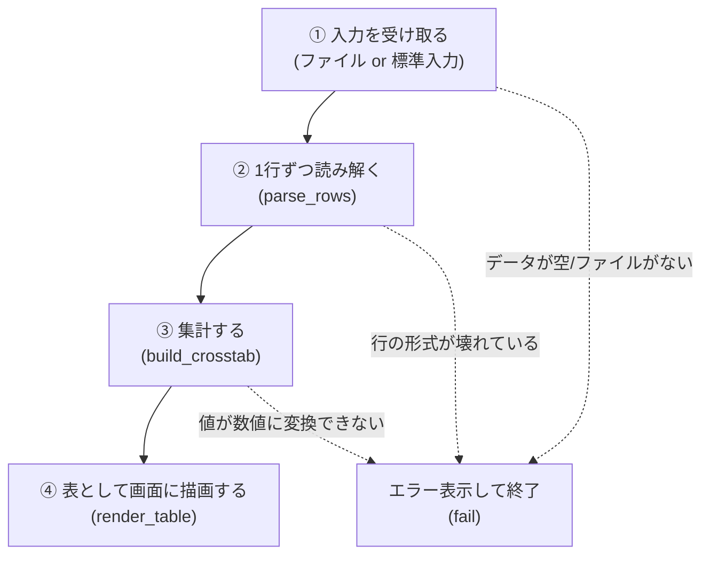

# crosstable.py 仕様書

対象ファイル: [`crosstable.py`](../crosstable.py)

この文書は、Pythonに詳しくない人がソースコードを読む際の助けとなるように、
「何を」「どういう手順で」処理しているかを日本語で説明するものです。
使い方(コマンドの叩き方)は [README.md](../README.md) を参照してください。
本書はプログラムの中身の仕様に焦点を当てます。

---

## 1. 全体仕様

### 1.1 このプログラムがすること

CSV形式のテキストデータ(列名, 行名, 任意で値)を読み込み、
「列名 × 行名」の表(クロス集計表)を作って画面に表示します。

- 表示には [rich](https://github.com/Textualize/rich) という外部ライブラリを使っており、
  罫線付きの見やすい表がターミナルに描画されます。
- 入力データの形によって、2種類の集計方法があります。

| 入力の列数 | `--numeric` 指定 | 動作 |
|---|---|---|
| 2列(列名, 行名) | なし | 「その組み合わせが存在するか」を `●`(存在)/`−`(不在)で表示 |
| 2列(列名, 行名) | あり | 同じ組み合わせが何回出現したかを数えて表示 |
| 3列(列名, 行名, 値) | あり | 同じ組み合わせの値をすべて合計して表示 |

### 1.2 処理の流れ(全体像)

プログラムは、大きく分けて次の4段階を順番に実行します。



1. **入力を受け取る**: コマンドライン引数でファイル名が指定されていればそのファイルを開き、
   指定がなければキーボードやパイプ経由の「標準入力」からデータを受け取ります。
2. **1行ずつ読み解く(パース)**: CSVの各行を「列名・行名・(あれば)値」に分解します。
   コメント行(`#`で始まる行)や空行はここで除外されます。
3. **集計する**: 分解した行を1件ずつ処理し、「列名の一覧」「行名の一覧」
   「セルごとの値、または存在フラグ」を作ります。
4. **表として描画する**: 集計結果を rich の表(Table)に変換し、画面に出力します。

途中でデータの不備(列が足りない、数値であるべき値が数値でない、
ファイルが存在しない等)が見つかった場合は、Pythonのエラーメッセージ(トレースバック)を
そのまま出すのではなく、日本語の短いエラーメッセージと使い方(ヘルプ)を表示して
プログラムを終了します(このプログラムでは「終了コード1」で終了 = 異常終了扱い)。

### 1.3 登場する部品(関数)の一覧

| 名前 | 役割 |
|---|---|
| `DataError` | 「入力データが原因のエラー」であることを表す目印(後述) |
| `natural_sort_key` | 行名・列名を「人間にとって自然な順番」に並べ替えるための下ごしらえ |
| `parse_rows` | CSVの1行を読み解いて「列名・行名・値」の組に変換する |
| `build_crosstab` | 読み解いた行をすべて集計し、表の材料(列名一覧・行名一覧・値)を作る |
| `format_number` | 集計値を表示用の文字列に整える(例: `3.0` を `3` と表示) |
| `render_table` | 集計結果を rich の表として画面に描画する |
| `fail` | エラーメッセージと使い方を表示してプログラムを終了する |
| `main` | コマンドライン引数を解釈し、上記の部品を順番に呼び出す司令塔 |

---

## 2. 関数ごとの仕様

### 2.1 `DataError` (例外クラス)

```python
class DataError(Exception):
    """入力データの内容に起因するエラー"""
```

- **これは何か**: Pythonの「例外(エラーを知らせる仕組み)」の一種です。
  「プログラムのバグ」ではなく「入力データの中身がおかしい」ことが原因で
  処理を続けられなくなったときに、この専用のエラーを発生させます。
- **使われ方**: `parse_rows` と `build_crosstab` の中で、データの不備を見つけた際に
  `raise DataError("〜というエラーです")` という形で発生させます。
  `main` 側でこれを受け止め(`except DataError as e:`)、
  ユーザー向けの分かりやすいメッセージとして表示します。
  Pythonの生のエラー画面(トレースバック)がユーザーの目に触れないようにするための仕組みです。

### 2.2 `natural_sort_key(value)`

```python
def natural_sort_key(value):
    return [int(part) if part.isdigit() else part.lower() for part in _NUMBER_RE.split(value)]
```

| 項目 | 内容 |
|---|---|
| 入力 | 文字列1つ(例: `"SrvAlice"`, `"100"`) |
| 出力 | 並べ替えに使う「比較用のリスト」(人が直接読むものではない) |
| 目的 | 行名・列名を「文字としての順番(辞書順)」ではなく「人間の感覚に近い順番(自然順)」で並べるための下準備 |

- 素朴に文字列として並べ替えると、`"100"` は `"50"` より前に来てしまいます
  (先頭の `"1"` が `"5"` より文字コード上小さいため)。
  数値としては `50 < 100` なので、これは直感に反します。
- この関数は、文字列を「数字の部分」と「数字以外の部分」に分解し、
  数字の部分は数値として、それ以外は小文字の文字列として扱うリストに変換します。
  Python標準の並べ替え(`sorted`)にこのリストを比較基準として渡すことで、
  `9, 50, 100` のような自然な順序を実現します(詳しくは `build_crosstab` の説明を参照)。
- 内部で使っている `_NUMBER_RE`(ファイル冒頭で定義)は、
  「連続した数字のかたまり」を見つけるための正規表現(文字列パターン)です。

### 2.3 `parse_rows(fp, delimiter)`

```python
def parse_rows(fp, delimiter):
    for line_num, raw_line in enumerate(fp, start=1):
        stripped = raw_line.strip()
        if not stripped or stripped.startswith("#"):
            continue
        fields = [f.strip() for f in next(csv.reader([raw_line], delimiter=delimiter))]
        if not fields or not fields[0]:
            continue
        if len(fields) < 2:
            raise DataError(f"{line_num}行目: 列が不足しています(列名,行名の2列以上が必要です): {stripped}")
        yield fields
```

| 項目 | 内容 |
|---|---|
| 入力 `fp` | 1行ずつ取り出せるもの(ファイル、標準入力、または文字列のリスト) |
| 入力 `delimiter` | 区切り文字(通常は `,`。タブの場合は `\t`) |
| 出力 | 「1行分の項目(列名・行名・[値])」のリストを、1件ずつ順番に返す |
| エラー | 列が1つしかない行があった場合に `DataError` を発生させる |

処理の流れ(1行ずつ、上から順に):

1. 何行目を処理しているかを数える(`line_num`)。エラーメッセージで「何行目が悪いか」を伝えるために使う。
2. 行の前後の空白を取り除いた文字列(`stripped`)を作り、
   - 何も書かれていない行(空行)、または
   - `#` で始まる行(コメント行)

   であればその行は無視して次の行に進む。
   ※ この判定は「引用符で囲む前の生の文字列」に対して行っている。
   これにより、`"#foo",1` のように「値としてたまたま `#` で始まる」ケースを
   誤ってコメント扱いしてしまう不具合を避けている。
3. コメント・空行でなければ、Python標準の `csv` モジュールを使って、
   区切り文字(カンマなど)で行を分割し、各項目の前後の空白を取り除く。
4. 分割した項目が0個、または1つ目の項目(列名にあたる部分)が空文字列であれば、
   その行は無視する。
5. 項目数が2個未満(=列名だけで行名がない等)であれば、
   「何行目に問題があるか」を含めたエラー(`DataError`)を発生させて処理を止める。
6. 上記のいずれにも当てはまらなければ、`[列名, 行名]` または `[列名, 行名, 値]`
   というリストとして、その行の内容を呼び出し元に渡す(`yield`)。

> **`yield` について**: この関数は「戻り値を1回返して終わり」ではなく、
> 呼び出し元が1件ずつ取り出すたびに、次の行を読んで返す、という動き方をします
> (Pythonでは「ジェネレータ」と呼ばれる仕組みです)。
> ファイル全体を一度にメモリへ読み込まず、1行ずつ処理できる利点があります。

### 2.4 `build_crosstab(rows, numeric)`

```python
def build_crosstab(rows, numeric):
    seen_columns = set()
    seen_rows = set()
    values = defaultdict(Decimal)
    present = set()

    for fields in rows:
        col, row = fields[0], fields[1]
        seen_columns.add(col)
        seen_rows.add(row)
        present.add((col, row))

        if numeric:
            if len(fields) >= 3:
                try:
                    values[(col, row)] += Decimal(fields[2])
                except InvalidOperation:
                    raise DataError(f"数値に変換できません: {fields[2]!r} (列={col}, 行={row})")
            else:
                values[(col, row)] += 1

    columns = sorted(seen_columns, key=natural_sort_key)
    row_names = sorted(seen_rows, key=natural_sort_key)
    return columns, row_names, values, present
```

| 項目 | 内容 |
|---|---|
| 入力 `rows` | `parse_rows` が返した「行」の集まり(各行は `[列名, 行名]` または `[列名, 行名, 値]`) |
| 入力 `numeric` | 数値モードかどうか(`True`/`False`) |
| 出力 `columns` | 列名の一覧(自然順に並べ替え済み) |
| 出力 `row_names` | 行名の一覧(自然順に並べ替え済み) |
| 出力 `values` | `(列名, 行名)` の組を鍵として、集計した数値を保持するもの |
| 出力 `present` | `(列名, 行名)` の組のうち、実際にデータが1回以上出現したものの集合 |
| エラー | 数値モードで3列目が数値として解釈できない場合に `DataError` を発生させる |

処理の流れ:

1. これから作る4つの入れ物を用意する。
   - `seen_columns` / `seen_rows`: 列名・行名の重複なしの集合(同じ名前は1回しか数えない)。
   - `values`: `(列名, 行名)` ごとの集計値。何も入っていない組み合わせを参照すると
     自動的に `0` として扱われる特殊な辞書(`defaultdict(Decimal)`)。
     `Decimal` は「小数を誤差なく正確に扱うための型」で、通常の小数計算(`float`)にある
     `0.1 + 0.2 = 0.30000000000000004` のような誤差が出ない。
   - `present`: 実際にデータが出現した `(列名, 行名)` の組の集合。
2. 渡された行を1件ずつ処理する。
   - 列名・行名を取り出し、それぞれの一覧に追加する。
   - `(列名, 行名)` の組を「出現した」ものとして記録する(`present`)。
   - 数値モード(`numeric=True`)の場合:
     - 3列目(値)がある行は、その値を数値(`Decimal`)に変換して積算する。
       変換できない文字列(例: `"abc"`)であれば、
       どの列・行のどんな値が原因かを含むエラー(`DataError`)を発生させる。
     - 3列目がない(2列しかない)行は、「1回出現した」として `1` を加算する
       (=同じ組み合わせの出現回数を数えることになる)。
   - 二値モード(`numeric=False`)の場合は、`values` への加算は行わない
     (「存在したかどうか」だけが重要なため、`present` の記録だけで十分)。
3. 最後に、列名一覧・行名一覧を `natural_sort_key`(2.2節)を基準に並べ替えて確定させる。
4. `columns`, `row_names`, `values`, `present` の4つをまとめて返す。

> **「データがない」と「実測値が0」の違いについて**:
> `values` には、実際に値が入力された組み合わせだけが登録されます。
> 一度も出現しなかった組み合わせは `values` に登録されないため、
> 呼び出し側(`render_table`)で「その組み合わせが `values` に入っているかどうか」を見ることで、
> 「本当にデータがない」のか「値として `0` が記録されている」のかを区別できます。

### 2.5 `format_number(value)`

```python
def format_number(value):
    if value == int(value):
        return str(int(value))
    return str(value)
```

| 項目 | 内容 |
|---|---|
| 入力 | 集計された数値(`Decimal`) |
| 出力 | 画面表示用の文字列 |

- 値が整数と等しい場合(例: `3` や `3.0`)は、小数点以下を付けずに `"3"` と表示する。
- 整数でない場合(例: `2.5`)は、そのまま `"2.5"` と表示する。
- これは「表示を整えるだけ」の関数で、集計そのものには関与しない。

### 2.6 `render_table(columns, row_names, values, present, numeric, title, ascii_mode=False, col_width=None, console_width=None)`

| 引数 | 内容 |
|---|---|
| `columns` / `row_names` | `build_crosstab` が作った列名・行名の一覧 |
| `values` / `present` | `build_crosstab` が作った集計結果 |
| `numeric` | 数値モードかどうか |
| `title` | 表のタイトル(未指定なら `None` = タイトルなし) |
| `ascii_mode` | `True` なら罫線・マークをASCII文字だけで描画する |
| `col_width` | 1列あたりの最大幅(文字数)。指定すると、はみ出す内容は省略せず折り返す |
| `console_width` | 表全体の描画幅(文字数)。指定しなければ端末の幅に自動で合わせる |

処理の流れ:

1. `ascii_mode` に応じて、使用するマーク(存在/不在の記号)と罫線の種類を選ぶ。
   - 通常時: `●`(存在)/ `−`(不在)、罫線はUnicodeの二重線。
   - ASCIIモード時: `O`(存在)/ `.`(不在)、罫線は `+`, `-`, `|` のみ。
2. rich の `Table` オブジェクト(表そのものを表すデータ)を、タイトルや罫線の設定込みで作る。
3. 一番左の列(行名を表示する列。見出しは空文字)と、`columns` の数だけ列を追加する。
   `col_width` が指定されていれば、はみ出す文字列を折り返す設定を各列に適用する。
4. `row_names` を1つずつ処理し、その行に入るセルの内容を組み立てる。
   - 数値モードなら: その `(列, 行)` の組み合わせが `values` にあれば集計値を表示し、
     なければ「データなし」を表す記号(`mark_absent`)を表示する。
   - 二値モードなら: その組み合わせが `present` にあれば `mark_present`、なければ `mark_absent`。
5. 組み立てた行を表に追加していく。
6. すべての行を追加し終えたら、rich の `Console`(画面出力を担当するオブジェクト)を使って、
   完成した表を実際に画面へ出力する。`console_width` が指定されていればその幅で描画する。

### 2.7 `fail(parser, message)`

```python
def fail(parser, message):
    print(f"エラー: {message}", file=sys.stderr)
    parser.print_help(sys.stderr)
    sys.exit(1)
```

| 引数 | 内容 |
|---|---|
| `parser` | コマンドライン引数の定義(2.8節の `main` で作られたもの)。使い方(ヘルプ)を表示するために使う |
| `message` | 表示するエラーの内容(日本語の短い説明文) |

- `エラー: <message>` という行と、コマンドの使い方(ヘルプ)を、
  通常の出力(`stdout`)ではなく「エラー出力」(`stderr`)に表示する。
  画面には両方まとめて表示されるが、出力を別のファイルに保存する際などに
  「通常の結果」と「エラー」を区別しやすくする目的がある。
- 最後に `sys.exit(1)` でプログラムを終了する。`1` は「異常終了」を表す慣習的な値。
  この関数が呼ばれた時点で、それ以降のコードは実行されない。

### 2.8 `main()`

コマンドを実行したときに最初に呼ばれる、全体の司令塔にあたる関数です。

処理の流れ:

1. **コマンドライン引数の定義**: `argparse` という標準ライブラリを使って、
   このプログラムが受け付けるオプション(`--numeric`, `--ascii` など)を定義する。
   `--help` で表示される説明文もここで一緒に定義されている。
2. **引数の解析**: 実際にユーザーが入力したコマンドを、定義に沿って読み取る(`args`)。
3. **区切り文字の調整**: `--delimiter '\t'` と指定された場合、それを実際のタブ文字に変換する
   (シェル上で本物のタブ文字を直接入力するのは手間がかかるため、この簡易記法を用意している)。
4. **入力データの読み込みと集計**(`try` ブロック。この中で起きた特定のエラーは後述の方法で捕まえる):
   - 入力ファイルが指定されていない(`-`)場合:
     - 標準入力がキーボード入力(端末に直接繋がっている状態、`isatty()` が真)であれば、
       データが渡されていないと判断し、`fail` でエラー表示して終了する。
     - そうでなければ、標準入力から `parse_rows` でデータを読み込む。
   - 入力ファイルが指定されている場合は、そのファイルを開いて `parse_rows` で読み込む。
   - 読み込んだ行が1件もなければ、`fail` でエラー表示して終了する。
   - `build_crosstab` を呼び、集計結果を得る。
5. **エラーの捕捉**:
   - ファイルが開けない場合(`OSError`。存在しない、権限がない等)は、
     ファイル名を含めたエラーメッセージを表示して終了する。
   - `parse_rows` や `build_crosstab` の中で発生した `DataError`
     (2.1節)は、そのメッセージをそのまま表示して終了する。
6. **表の描画**: ここまでにエラーで終了していなければ、`render_table` を呼び出して
   実際に表を画面に出力する。

最後に、ファイルの一番下にある

```python
if __name__ == "__main__":
    main()
```

という部分により、「このファイルが直接 `python crosstable.py ...` として実行されたときだけ
`main()` を呼び出す」という動作になっています
(他のPythonファイルからこのファイルを部品として読み込んだ場合には、
`main()` は自動的には実行されません)。

---

## 3. 用語ミニ解説(Python初学者向け)

| 用語 | この文書での意味 |
|---|---|
| 関数 (function) | ひとまとまりの処理に名前を付けたもの。`def 名前(引数):` の形で定義される |
| 引数 (argument) | 関数に渡す入力値 |
| 戻り値 (return value) | 関数の処理結果として返ってくる値 |
| 例外 (exception) | 処理中に起きた「通常でない事態」を表す仕組み。`raise` で発生させ、`except` で受け止める |
| リスト (list) | 複数の値を順番に並べて持つデータ(例: `["SrvAlice", "1"]`) |
| 辞書 (dict) | 「鍵(key)」と「値(value)」の組を保持するデータ。`values[(列名, 行名)]` のように鍵を指定して値を取り出す |
| 集合 (set) | 重複を許さない値の集まり。同じ値を何度追加しても1つとして扱われる |
| ジェネレータ (generator) | `yield` を使い、値を1つずつ順番に生成して返す特殊な関数(2.3節参照) |
